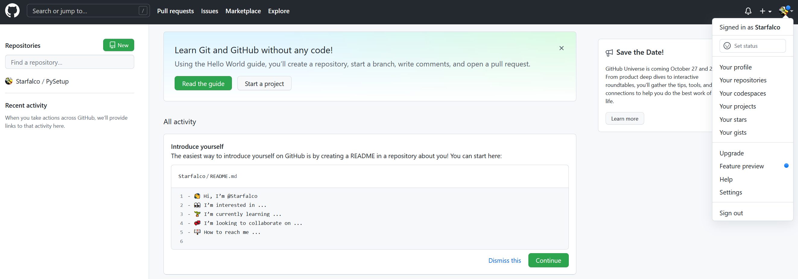
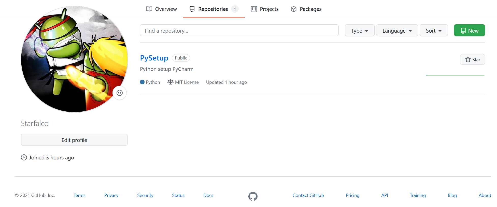
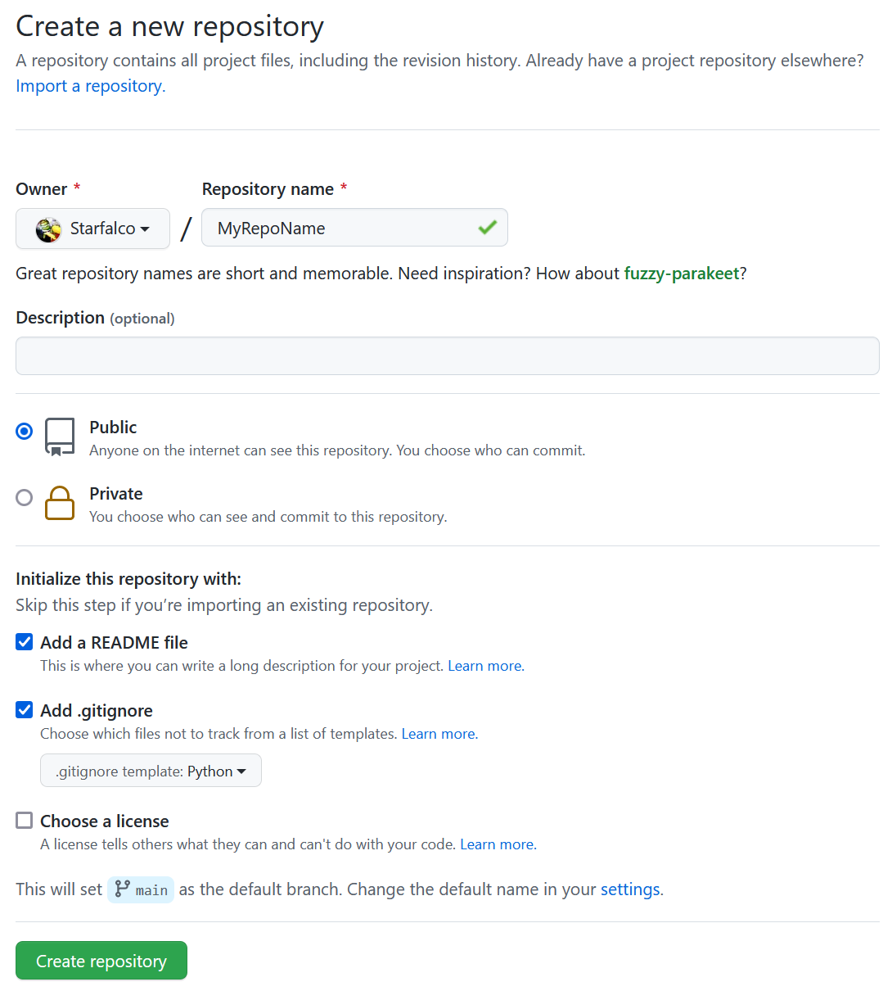
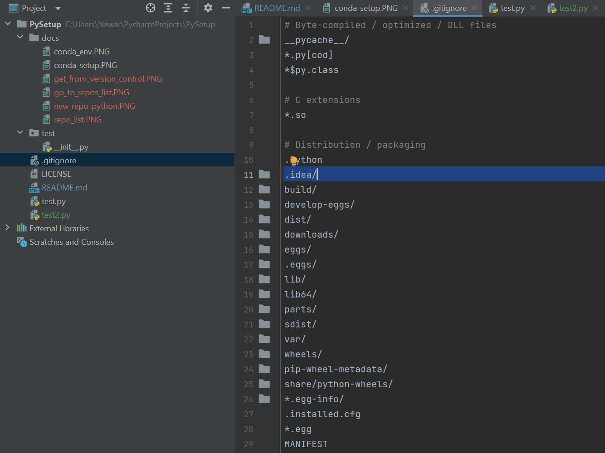
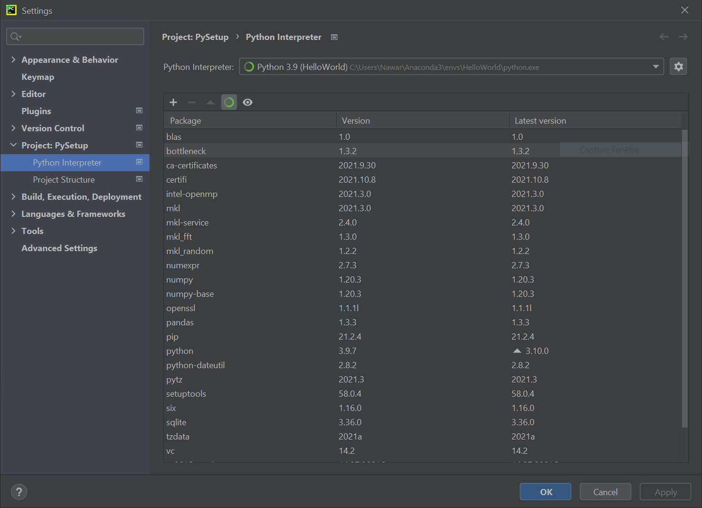
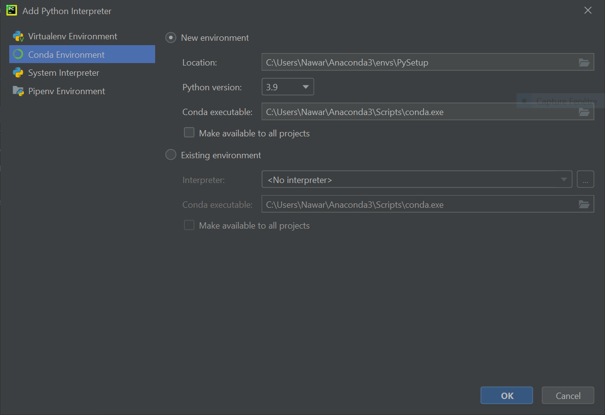

# PySetup
Python setup PyCharm

## Github set up

Go to repos list


Create new repos, green button up right


New repo set up (python example)
ps : don't forget to check README file and .gitignore option


then add ".idea/"


## Conda env

File > Settings > Project > Engrenage > Add





## Conda/pip install

launch anaconda prompt > change environment :
```shell
conda activate Env2
```
conda install instruction example :
```shell
conda install yfinance
```
pip install instruction example :
 ```shell
pip install yfinance
```